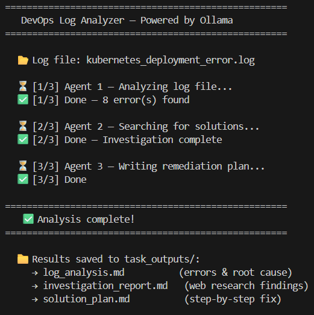

# DevOps Log Analyzer

A multi-agent AI pipeline that analyzes DevOps log files, searches the web for solutions, and generates a step-by-step remediation plan — running entirely locally for free using Ollama.

## How It Works

Three agents run sequentially, each passing their output to the next:

1. **Log Analyzer** — reads the log file and extracts all errors, root cause, affected components, and a timeline of events
2. **Issue Investigator** — takes the analysis and searches the web via DuckDuckGo for relevant solutions and documentation
3. **Solution Specialist** — synthesizes everything into a detailed remediation plan with copy-pasteable shell commands

```
Log File → Agent 1 → Agent 2 → Agent 3 → Fix Plan
```

Built with [CrewAI](https://github.com/crewaiinc/crewai) for agent orchestration and [Ollama](https://ollama.com) to run the LLM locally.


## Demo



## Prerequisites

- Python 3.10+
- [Ollama](https://ollama.com/download) installed and running

## Setup

**1. Clone the repo and navigate to the project folder**
```bash
git clone <your-repo-url>
cd devops-log-analyzer
```

**2. Install dependencies**
```bash
pip install -r requirements.txt
```

**3. Pull the model**
```bash
ollama pull qwen3.5:4b
```

**4. Make sure Ollama is running**
```bash
ollama serve
```

**5. Update the log file path in `main.py`**
```python
inputs={"log_file_path": "/path/to/your/logfile.log"}
```

**6. Run**
```bash
python main.py
```

## Output

Results are saved to `task_outputs/` after each run:

| File | Contents |
|------|----------|
| `log_analysis.md` | Errors found, root cause, affected components, timeline |
| `investigation_report.md` | Web research findings and known solutions |
| `solution_plan.md` | Step-by-step remediation plan with shell commands |

## Example

Input: a Kubernetes deployment log with an `ImagePullBackOff` error

Output from `solution_plan.md`:
```bash
# Create the registry secret
kubectl create secret docker-registry myapp-registry-secret \
  --docker-server=your-private-registry \
  --docker-username=your-username \
  --docker-password=your-password

# Apply the updated deployment
kubectl apply -f deployment.yaml

# Monitor pod status
kubectl get pods -n production -w
```

## Stack

- [CrewAI](https://github.com/crewaiinc/crewai) — multi-agent orchestration
- [Ollama](https://ollama.com) — local LLM inference
- [qwen3.5:4b](https://ollama.com/library/qwen3.5:4b) — default model
- [ddgs](https://pypi.org/project/ddgs/) — free web search, no API key needed

## Notes

- Runs fully locally — no API keys, no costs
- Each run takes a few minutes depending on your hardware
- Tested on a machine with 16GB RAM and RTX 3050 6GB VRAM
- To use a different model, change the model name in `agents.py`
